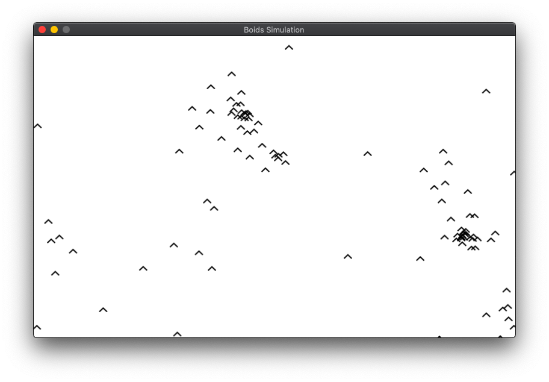

# boids-rs

A work in progress [Boids simulation](http://www.red3d.com/cwr/boids/) built with [Rust](https://www.rust-lang.org/) and [Quicksilver](https://ryanisaacg.com/quicksilver/).



## Usage

```
git clone https://github.com/mvrilo/boids-rs/
cd boids-rs
cargo run
```

## Author

Murilo Santana <<mvrilo@gmail.com>>

## Related projects and references

- http://www.red3d.com/cwr/boids/
- https://docs.rs/quicksilver/0.4.0-alpha0.7/
- https://medium.com/better-programming/boids-simulating-birds-flock-behavior-in-python-9fff99375118
- https://github.com/healeycodes/boids
- https://github.com/jackaperkins/boids
